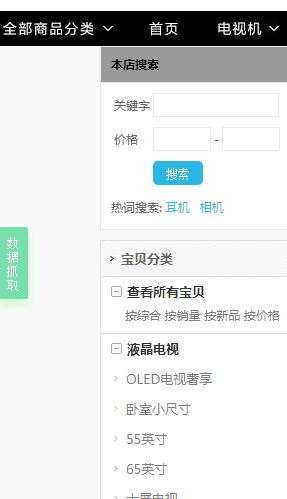
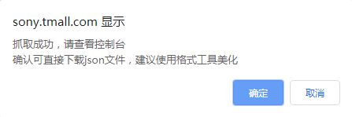
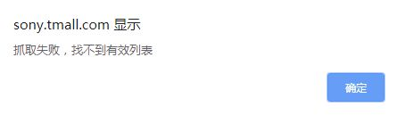
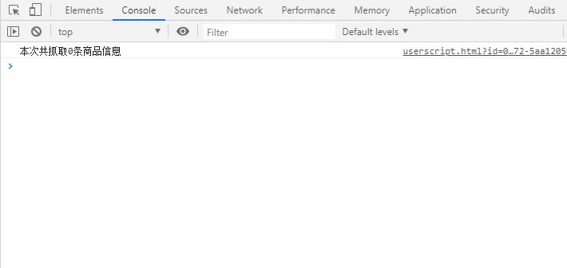
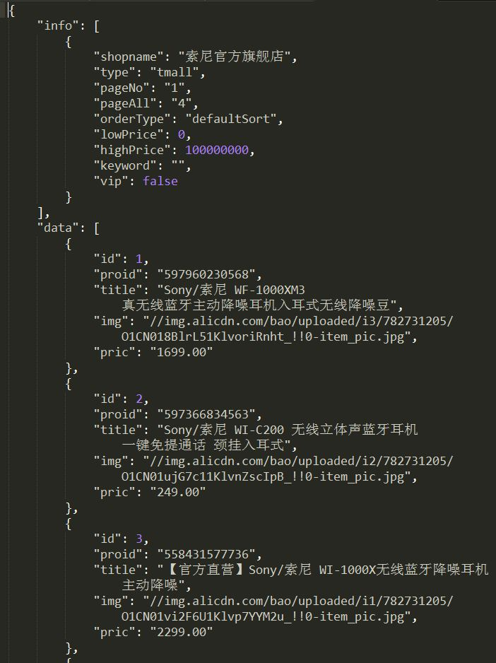

# catchProducts_TaobaoTmall
JS抓取淘宝和天猫店铺的商品信息（需在Tampermonkey上使用）

# 环境支持
[Tampermonkey](http://www.tampermonkey.net/)

# 脚本说明
引用Jquery简化代码操作，以img为中心抓取；支持淘宝与天猫的category和search页

# 操作步骤
1. 打开店铺所有宝贝页，点击页面左侧中间数据抓取按钮即可



2. 抓取提示
  - 成功
  


  
  - 失败
  



3. 抓取成功可点击确认下载文件data.json



# 抓取信息说明
1. 结构一览

```json
  {
    "info":[{
      "shopname":"",
      "type":"",
      "pageNo":"",
      "pageAll":"",
      "orderType":"",
      "lowPrice":"",
      "highPrice":"",
      "keyword":"",
      "vip":"",
    }],  
    "data":[{
      "id":"",
      "proid":"",
      "title":"",
      "img":"",
      "pric":"",
    }]
  }
```

2. 信息说明
  - info(店铺及搜索条件信息)
  
  | 元素 | 类型 | 说明 |
  | :----: | :----: | :----: |
  | shopname | string | 店铺名称 |
  | type | string | 网站类型 |
  | pageNo | int | 当前页码 |
  | pageAll | int | 总页码 |
  | orderType | string | 排序方式 |
  | lowPrice | float | 最低价格 |
  | highPrice | float | 最高价格 |
  | keyword | string | 关键字 |
  | vip | bool | 店铺VIP商品(天猫) |
  
  - data(商品信息)
  
  | 元素 | 类型 | 说明 |
  | :----: | :----: | :----: |
  | id | int | 序号 |
  | proid | string | 商品编号 |
  | title | string | 商品名称 |
  | img | string | 商品主图地址 |
  | pric | string | 商品价格 |

# 开源协议
MIT License
